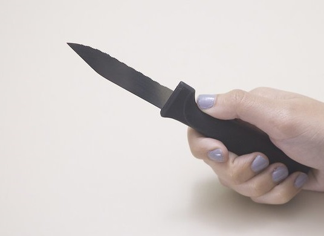
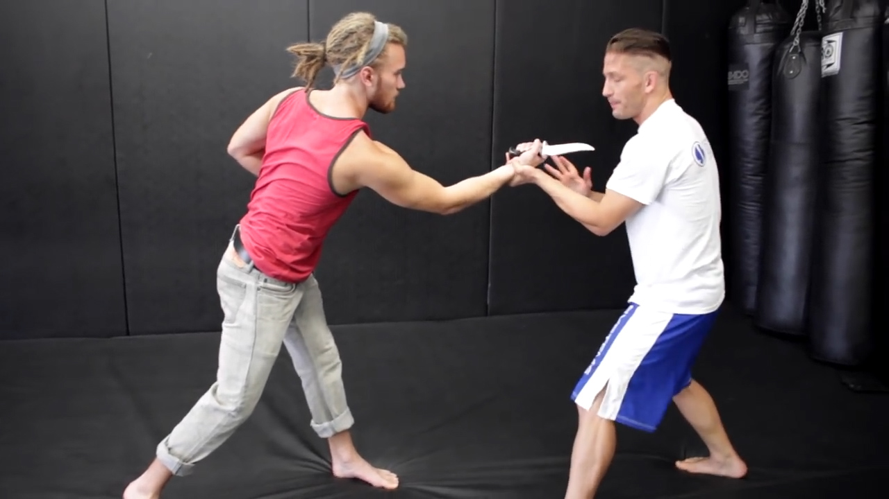

# Weapon Detection with Transfer Learning
In this project we attempt to use a pretrained YOLOv5 model to detect weapons in various scenarios.  
We use Transfer-Learning by training only the last layers on the new dataset to achieve this task.  
Class project as part of ee046211 - Deep Learning course @ Technion.  

    <a href="https://www.linkedin.com/in/itamar-ginsberg/">Itamar Ginsberg</a>  •  
    <a href="https://il.linkedin.com/in/alon-nemirovsky-3082651b4">Alon Nemirovsky</a>

- [Weapon Detection with Transfer Learning](#Weapon%20Detection%20with%20Transfer%20Learning)
  * [Background](#Background)  
  * [Dataset](#Dataset)  
  * [Model](#Model)  
  * [Files in the repository](#Files%20in%20the%20repository)
  * [Sources](#Sources)

## Background

## Dataset
We use the [ari-dasci/OD-WeaponDetection](https://github.com/ari-dasci/OD-WeaponDetection) dataset, mainly 'Knife Detection' and 'Pistol Detection'.  
The data includes 3000 pistol images and 2078 knife images.  
**Image examples from the dataset:**  

    

   

**Annotation examples from the dataset: (matching the images above)**  
 [0 0.378 0.387 0.205 0.332]  
 [0 0.531 0.536 0.179 0.326]  
 [0 0.501 0.506 0.424 0.364]  
 [1 0.351 0.669 0.163 0.105]  
 [1 0.521 0.449 0.647 0.601]  
 [1 0.618 0.297 0.116 0.081]  

Each file includes the class number of the detect object (0 - pistol, 1 - knife) and 4 points (normalized) indicating the object bounding box.

## Model

*TODO - insert exaplanation about YOLOv5 architecture

## Files in the repository

*TODO - fill in file descriptions
|File name         | Description |
|----------------------|------|
|`file name 1`| File 1 Description|
|`file name 2`| File 2 Description|

## Results
# TODO - fill in results and screenshot

## Presentation
*TODO - links to youtube and slides
- [Recording](URL) of in-class project presentation (Hebrew only)
- Slides can be found [here](URL)

## Sources  
*TODO - more resources
- [[1]](https://www.kaggle.com/c/cassava-leaf-disease-classification) Kaggle dataset and challenge
- [[2]](https://github.com/ultralytics/yolov5) Ultraylytics YOLOv5 repository
