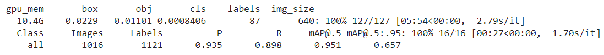
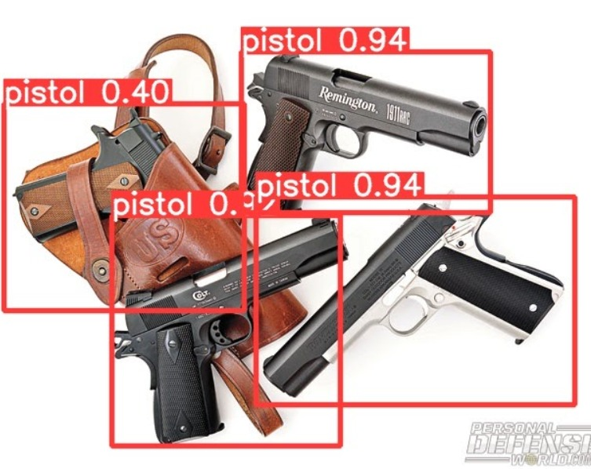
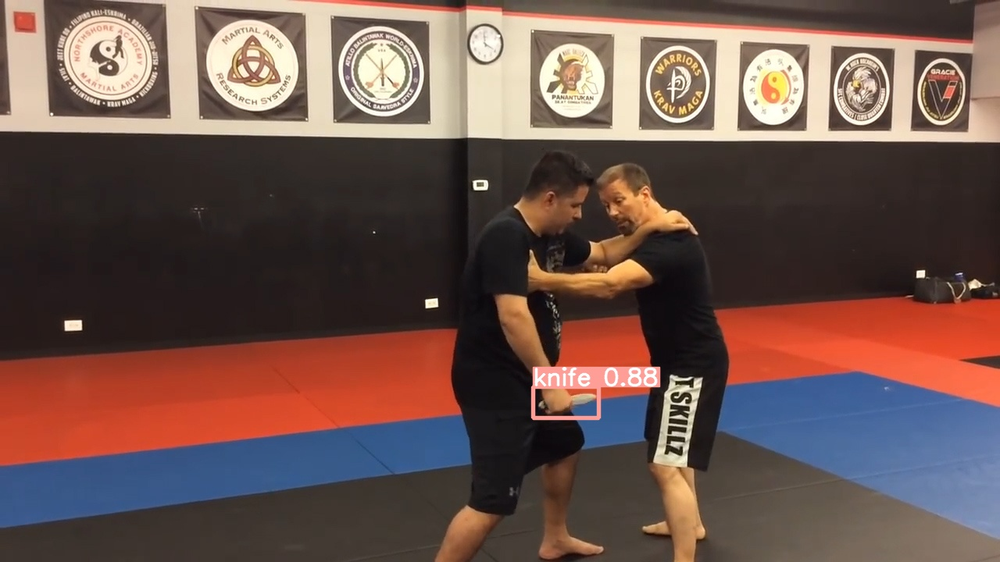

# Weapon Detection with Transfer Learning
In this project we attempt to use a pretrained YOLOv5 model to detect weapons in various scenarios.  
We use Transfer-Learning by performing additional training on a pre-trained network, using the new dataset, to achieve this task.  
This is a class project as part of EE046211 - Deep Learning course @ Technion.  

    <a href="https://www.linkedin.com/in/itamar-ginsberg/">Itamar Ginsberg</a>  •  
    <a href="https://il.linkedin.com/in/alon-nemirovsky-3082651b4">Alon Nemirovsky</a>

- [Weapon Detection with Transfer Learning](#Weapon%20Detection%20with%20Transfer%20Learning)
  * [Background](#Background)  
  * [Dataset](#Dataset)  
  * [Model](#Model)  
  * [Files in the repository](#Files%20in%20the%20repository)
  * [Sources](#Sources)

## Background
To ensure citizens' safety, we want to enable security cameras to automatically detect a person carrying a weapon, so security services can be quickly alerted and can then decide on the best course of action, thus dramatically reducing response time to save lives. 
For this purpose, we take advantage of an advanced neural-network architecture utilized for detection tasks in other domains through the technique of transfer-learning and fine-tuning.

## Dataset
We use the [ari-dasci/OD-WeaponDetection](https://github.com/ari-dasci/OD-WeaponDetection) dataset, mainly 'Knife Detection' and 'Pistol Detection'.  
The data includes 3000 pistol images and 2078 knife images, many of which feature life-like scenarios.
**Image examples from the dataset:**  

    

   

**Annotation examples from the dataset: (matching the images above)**  
 [0 0.378 0.387 0.205 0.332]  
 [0 0.531 0.536 0.179 0.326]  
 [0 0.501 0.506 0.424 0.364]  
 [1 0.351 0.669 0.163 0.105]  
 [1 0.521 0.449 0.647 0.601]  
 [1 0.618 0.297 0.116 0.081]  

Each file includes the class number of the detected object (0 - pistol, 1 - knife) and 4 points (normalized) indicating the object's bounding box.

## Model

    

YOLO (You Only Look Once) divides an image into a grid system, where each grid detects objects within itself. It is a very fast algorithm that can be used for *real-time* object detection based on data streams, while requiring very few computational resources.  
The architecture of a detection network is generally made up of a backbone (responsible for feature extraction) and a head (responsible for bounding-box and label prediction). In many instances, the model also includes a 'neck' between the backbone and head (responsible for feature fusion).

    

For YOLOv5, the backbone is carried out by the CSPDarknet53 CNN, the neck uses PANet and the head is a YOLO layer.
While yolov4(April 2020) introduced new augmentations such as Mosaic and Self-Adversarial-Training, YOLOv5, released a month later by Glenn Jocher, features implementation based on the PyTorch framework and the use of .yaml files for configuration.  
Currently (1/22) there is no official paper on this model.  
Ultralytics offers a choice of 5 YOLOv5 models, differing mainly in size and complexity:

  

## Files in the repository
|File name         | Description |
|----------------------|------|
|`DL_project_code`| Main code file - includes setup, data reformatting and reorganization, training the model and using the outcome to detect new images|
|`yolov5/data/Weapons.yaml`| Definition of dataset location, number of classes and names|
|`yolov5/data/hyps/hyp.scratch.yaml`| Definition of the model's hyperparameters and augmentation parameters|
|`yolov5/models/yolo5*.yaml`| Configuration file for { Nano (n) / Small (s) / Medium (m) / Large (l) / XLarge (x) } models|
|`yolov5/runs`| Location of runs' data and results for both training and detection|
|`repository_images`| Images used for preview in README.md file|

## Results

As shown in the resulting images above, our model was able to detect the desired objects, even in dense or very small instances, both of which are known to be weaknesses of the classic YOLO algorithm.

## Presentation
*TODO - links to youtube and slides  
- [Recording](URL) of in-class project presentation (Hebrew only)
- Slides can be found [here](https://docs.google.com/presentation/d/1YwvSj-yY5Msszw83hv6qB6qxPFPEGPw6swNo3wLiULk/edit?usp=sharing)

## Sources  
*TODO - more resources  
[1] ari-dasci/[OD-WeaponDetection](https://github.com/ari-dasci/OD-WeaponDetection) full dataset  
[2] v7labs - [YOLO: Real-Time Object Detection Explained](https://www.v7labs.com/blog/yolo-object-detection)  
[3] Ultralytics [YOLOv5 repository](https://github.com/ultralytics/yolov5)   
[4] Ultralytics [YOLOv5 documentation](https://docs.ultralytics.com/)  
[5] Bochkovskiy, A., Wang, C.Y. and Liao, H.Y.M., 2020. [Yolov4: Optimal speed and accuracy of object detection](https://arxiv.org/abs/2004.10934) (arXiv preprint arXiv:2004.10934.)  
[6] analytics-vidhya (Medium): [Object Detection Algorithm — YOLO v5 Architecture](https://medium.com/analytics-vidhya/object-detection-algorithm-yolo-v5-architecture-89e0a35472ef)
